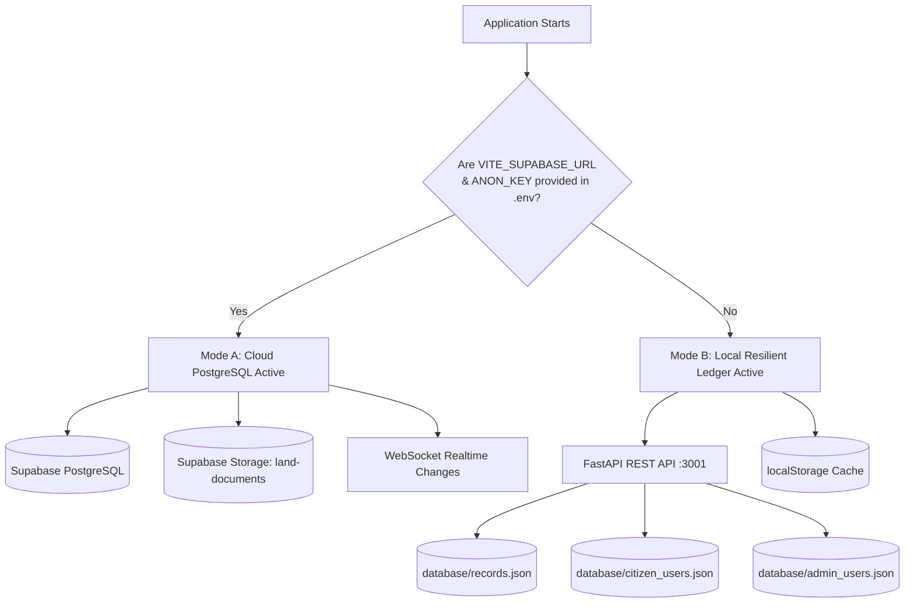
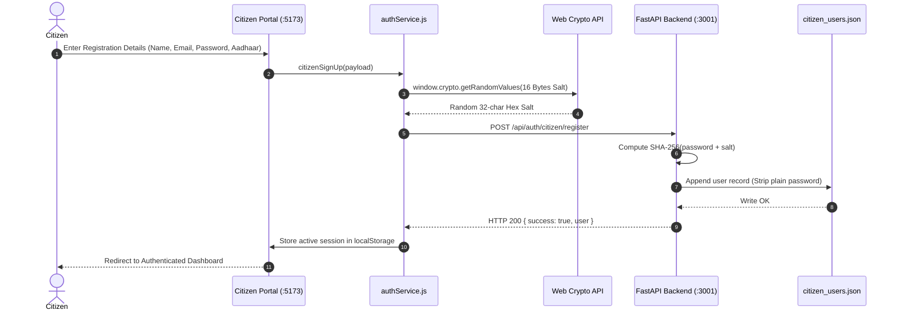
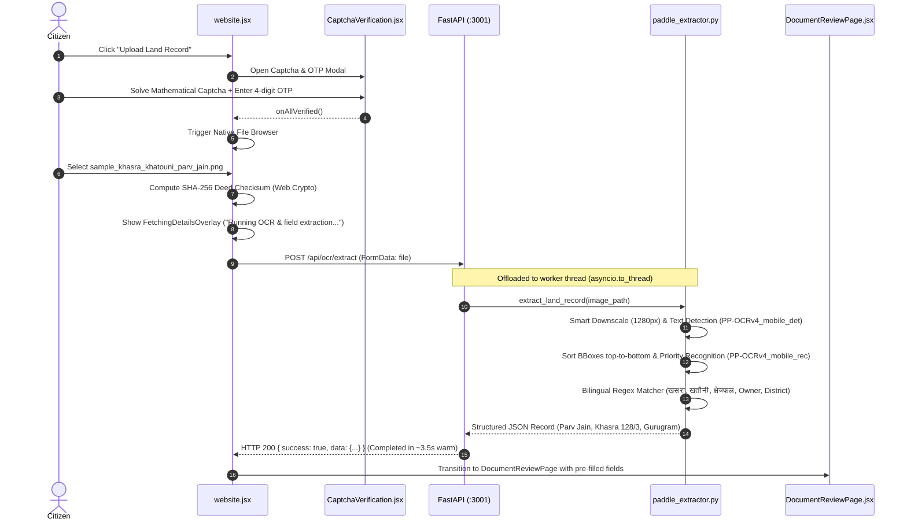
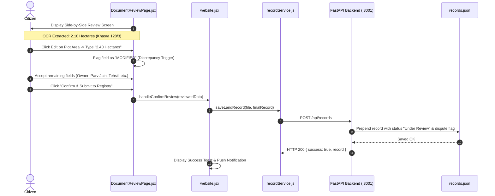
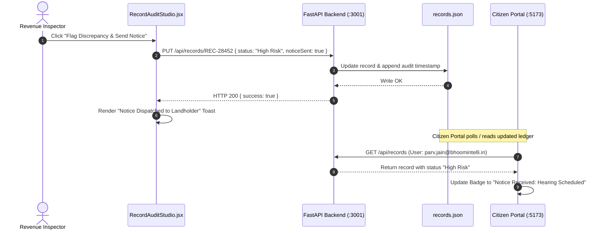

# BhoomiIntelli: Complete System Workflow & Architecture Manual
**Smart India Hackathon 2026 (Problem Statement: SIH 26018)**  
*Intelligent Land Record Digitization, Validation, Discrepancy Detection & Revenue Audit System*

---

## Table of Contents
1. [Executive Summary & System Purpose](#1-executive-summary--system-purpose)
2. [High-Level Topology & Multi-Service Orchestration](#2-high-level-topology--multi-service-orchestration)
3. [Dual-Mode Database Architecture (Local Resilient vs. Cloud PostgreSQL)](#3-dual-mode-database-architecture)
4. [Workflow 1: Citizen Onboarding, Authentication & Security Gating](#4-workflow-1-citizen-onboarding-authentication--security-gating)
5. [Workflow 2: Document Ingestion, CAPTCHA/OTP & PaddleOCR Extraction](#5-workflow-2-document-ingestion-captchaotp--paddleocr-extraction)
6. [Workflow 3: Citizen Document Review & Discrepancy Submission](#6-workflow-3-citizen-document-review--discrepancy-submission)
7. [Workflow 4: Admin Tri-Pane Cadastral Audit Studio](#7-workflow-4-admin-tri-pane-cadastral-audit-studio)
8. [Workflow 5: Audit Ledger Updates & Real-Time Synchronization](#8-workflow-5-audit-ledger-updates--real-time-synchronization)
9. [Comprehensive File-by-File Responsibility Directory](#9-comprehensive-file-by-file-responsibility-directory)
10. [Verification, Health Checks & Operational Guide](#10-verification-health-checks--operational-guide)

---

## 1. Executive Summary & System Purpose

**BhoomiIntelli** is an enterprise-grade digital public infrastructure platform built for the Department of Land Resources (DoLR) and state revenue departments. It solves the critical bottleneck of slow, error-prone manual paper deed digitization and prevents land fraud through:

- **Bilingual Neural OCR**: Deep-learning extraction of revenue land records in both Hindi (देवनागरी: खसरा, खतौनी, क्षेत्रफल, तहसील, जिला) and English.
- **Digital Deed Fingerprinting**: Immutable SHA-256 cryptographic hashing of deed files at upload to guarantee tamper-proofing.
- **Citizen Human-in-the-Loop Review**: Allows landholders to verify AI-extracted fields and declare discrepancies.
- **Tri-Pane Revenue Audit Studio**: An official workbench for Revenue Inspectors and Tehsildars with side-by-side verification (Original Document ↔ AI OCR Stream ↔ Discrepancy Matrix).
- **Zero-Dependency Resilience**: A dual-mode data layer that operates smoothly in offline environments or with full Supabase PostgreSQL cloud sync.

---

## 2. High-Level Topology & Multi-Service Orchestration

The application is architected as three decoupled microservices coordinated via `start_all.bat`:

```mermaid
graph TD
    subgraph Launch Layer
        BAT["start_all.bat (1-Click Multi-Service Launcher)"]
    end

    subgraph Service Tier
        OCR["PaddleOCR & FastAPI Microservice<br/><b>Port 3001</b><br/>Python 3.11 / Uvicorn"]
        CITIZEN["Citizen Land Record Portal<br/><b>Port 5173</b><br/>React 19 / Vite / i18n 22 Langs"]
        ADMIN["Admin Audit Studio Portal<br/><b>Port 5174</b><br/>React 19 / Vite / Tri-Pane View"]
    end

    subgraph Storage & Persistence Tier
        LOCAL_DB["Local Resilient JSON Ledger<br/>database/records.json<br/>database/citizen_users.json<br/>database/admin_users.json"]
        CLOUD_DB["Supabase PostgreSQL 15+<br/>land_records, citizen_users, audit_trail<br/>Storage Bucket: land-documents"]
    end

    BAT -->|Spawns Console 1| OCR
    BAT -->|Spawns Console 2| CITIZEN
    BAT -->|Spawns Console 3| ADMIN

    CITIZEN <-->|REST API: OCR & Records| OCR
    ADMIN <-->|REST API: Records & Users| OCR

    OCR <-->|Read / Write (Mode A)| LOCAL_DB
    CITIZEN <-->|Optional Direct SDK (Mode B)| CLOUD_DB
    ADMIN <-->|Optional Direct SDK (Mode B)| CLOUD_DB
```

### Port Allocations:
| Component | Port | Technology | Primary Entry Point |
| :--- | :--- | :--- | :--- |
| **Backend & OCR** | `3001` | FastAPI, Python 3.11, PaddleOCR | `ocr-service/main.py` |
| **Citizen Portal** | `5173` | React 19, Vite, Vanilla CSS, i18n | `landrecord/src/main.jsx` |
| **Admin Portal** | `5174` | React 19, Vite, Tri-Pane CSS | `Admin Portal/src/main.jsx` |

---

## 3. Dual-Mode Database Architecture

The system features an automatic failover persistence architecture:



### Mode Comparison:
1. **Mode A: Cloud PostgreSQL (Production Cloud)**:
   - Evaluated via `isSupabaseConfigured` in `database/supabase.js`.
   - Executes SQL queries against relational tables (`land_records`, `citizen_users`, `admin_users`, `land_audit_trail`).
   - Uploads binary PDFs/images to Supabase Storage bucket `land-documents`.
   - Emits real-time push notifications over WebSocket `postgres_changes` subscriptions.
2. **Mode B: Local Resilient Ledger (Offline / Evaluation)**:
   - When environment variables are blank (default state), the frontend automatically communicates with `http://localhost:3001/api/records` and `http://localhost:3001/api/auth/*`.
   - FastAPI atomic file locks write to `database/*.json`.
   - Ensures that judges and developers can evaluate all functions without registering for third-party cloud keys.

---

## 4. Workflow 1: Citizen Onboarding, Authentication & Security Gating



### Security Guardrails:
1. **Password Hashing**: SHA-256 combined with a 16-byte cryptographic salt per user. Passwords are never stored in plain text anywhere in the codebase or memory.
2. **Brute Force Lockout**: `authService.js` tracks failed login attempts per email. After 3 failed attempts, a 30-second cryptographic cooldown lockout is enforced.
3. **Aadhaar Privacy Gating**: Raw 12-digit Aadhaar input is immediately masked to `XXXX XXXX 1234` before being committed to persistent storage.
4. **Mobile Verification Upload Guard**: To prevent anonymous document spam, deed upload is gated behind a verified phone number.

---

## 5. Workflow 2: Document Ingestion, CAPTCHA/OTP & PaddleOCR Extraction



### Why the Extraction is Fast and Reliable:
- **Lightweight Mobile Models**: Uses `PP-OCRv4_mobile_det` and `PP-OCRv4_mobile_rec`, completely avoiding heavy 3D unwarping models (`UVDoc`) that cause CPU thrashing.
- **PIR Compatibility Fix**: Disabled PIR (`enable_new_ir(False)`) and MKLDNN in PaddleX inference engine to bypass Windows oneDNN C++ assertion errors.
- **Thread Pool Delegation**: Synchronous C++ inference runs in `asyncio.to_thread`, keeping FastAPI's event loop completely non-blocking.
- **18-Second Frontend Timeout Guard**: An `AbortController` in `website.jsx` ensures the citizen is never trapped in the loading overlay under any circumstances.

---

## 6. Workflow 3: Citizen Document Review & Discrepancy Submission



### The Primary Evaluation Record (`REC-28452`):
- **Citizen Name**: Parv Jain (`parv.jain@bhoomintelli.in`)
- **Deed ID**: Deed-142 (Conveyance Deed)
- **Khasra / Khata**: Khasra `128/3`, Khata `KH-442`
- **Location**: Khandsa Village, Gurugram Sadar, Haryana
- **Discrepancy**: AI OCR extracted `2.10 Hectares` (Confidence 88%). Citizen declared `2.40 Hectares`.
- **System Action**: Automatically flags parcel with `disputeStatus: "Area Discrepancy (OCR 2.10 Ha vs Citizen 2.40 Ha)"` and routes to the Tehsildar priority audit queue.

---

## 7. Workflow 4: Admin Tri-Pane Cadastral Audit Studio

When an administrative officer logs into `http://localhost:5174`:

```mermaid
flowchart TD
    Login[Admin Login :5174<br/>inspector@bhoomintelli.in] --> Dash[Admin Dashboard]
    Dash --> Notif[Click Notification: Discrepancy in REC-28452]
    Notif --> Studio[RecordAuditStudio.jsx<br/>Tri-Pane Split View 1:1:1]
    
    subgraph Pane 1: Original Deed Viewer
        DocView[Document Viewer]
        Zoom[Zoom 50% - 175% / Rotate]
        SealBadge[Digital SHA-256 Seal Stamp]
    end

    subgraph Pane 2: AI OCR Extraction Stream
        BBox[Bounding Boxes & Labels]
        Scores[OCR Confidence Scores: 88% - 99%]
        Coord[Cadastral Coordinates]
    end

    subgraph Pane 3: Audit Discrepancy Matrix
        Matrix[AI OCR vs Citizen Value Table]
        Alert[Discrepancy Banner: Area mismatch]
        Actions[Action Buttons]
    end

    Studio --> Pane 1
    Studio --> Pane 2
    Studio --> Pane 3

    Actions --> A1["Approve & Seal (Stamp Good Record)"]
    Actions --> A2["Flag & Dispatch Revenue Notice"]
    Actions --> A3["Reject Record (Fraud Prevention)"]
```

### Tri-Pane Architectural Breakdown:
1. **Pane 1 (Left 1/3): Original Document Viewer**:
   - High-fidelity zoom, drag, and rotation of the deed document.
   - Embeds the cryptographic fingerprint seal (`SHA256:7f4a21...`).
2. **Pane 2 (Middle 1/3): AI OCR Extraction Stream**:
   - Displays real-time optical recognition streams with color-coded bounding boxes.
   - Highlights extraction confidence per token.
3. **Pane 3 (Right 1/3): Side-by-Side Audit Matrix**:
   - Direct field comparison (AI OCR Value vs. Citizen Declared Value).
   - Instant visual flagging of altered fields (amber highlight for discrepancies).
   - Allows Revenue Inspector to override or accept values before final approval.

---

## 8. Workflow 5: Audit Ledger Updates & Real-Time Synchronization



---

## 9. Comprehensive File-by-File Responsibility Directory

### 9.1 Root Directory
| File | Role & Responsibilities |
| :--- | :--- |
| [`start_all.bat`](file:///c:/Users/Jagrit%20Bansal/OneDrive/Desktop/SIH-2026-/start_all.bat) | Windows batch automation script. Verifies virtual environments and `node_modules`, then launches all 3 microservices concurrently in titled command windows. |
| [`.gitignore`](file:///c:/Users/Jagrit%20Bansal/OneDrive/Desktop/SIH-2026-/.gitignore) | Excludes node dependencies, virtual environments, build artifacts, Python bytecode, and downloaded PaddleOCR models from Git. |

---

### 9.2 OCR & Backend Service (`ocr-service/`)
| File | Role & Responsibilities |
| :--- | :--- |
| [`main.py`](file:///c:/Users/Jagrit%20Bansal/OneDrive/Desktop/SIH-2026-/ocr-service/main.py) | Primary FastAPI backend. Implements endpoints for PaddleOCR extraction (`/api/ocr/extract`), health monitoring (`/api/ocr/health`), citizen auth (`/api/auth/citizen/*`), admin auth (`/api/auth/admin/*`), and land record CRUD (`/api/records/*`). Uses `asyncio.to_thread` for non-blocking OCR. |
| [`paddle_extractor.py`](file:///c:/Users/Jagrit%20Bansal/OneDrive/Desktop/SIH-2026-/ocr-service/paddle_extractor.py) | Neural OCR engine. Loads `PP-OCRv4_mobile_det` and `PP-OCRv4_mobile_rec`. Performs image downscaling, top-to-bottom bounding box sorting, SHA-256 deed hashing, and bilingual regular expression extraction. |
| [`generate_sample_documents.py`](file:///c:/Users/Jagrit%20Bansal/OneDrive/Desktop/SIH-2026-/ocr-service/generate_sample_documents.py) | Utility script using Pillow to generate high-resolution synthetic revenue deeds with government seals and Hindi/English tables for automated testing. |
| [`requirements.txt`](file:///c:/Users/Jagrit%20Bansal/OneDrive/Desktop/SIH-2026-/ocr-service/requirements.txt) | Python dependencies: `fastapi`, `uvicorn`, `paddlepaddle`, `paddleocr`, `opencv-python-headless`, `pydantic`. |
| [`.env` / `.env.example`](file:///c:/Users/Jagrit%20Bansal/OneDrive/Desktop/SIH-2026-/ocr-service/.env.example) | Environment variables for port binding, CORS allowed origins, and secret keys. |

---

### 9.3 Database Layer (`database/`)
| File | Role & Responsibilities |
| :--- | :--- |
| [`schema.sql`](file:///c:/Users/Jagrit%20Bansal/OneDrive/Desktop/SIH-2026-/database/schema.sql) | Production PostgreSQL schema for Supabase: tables for `citizen_users`, `admin_users`, `land_records`, and `land_audit_trail` with Row-Level Security (RLS) policies. |
| [`supabase.js`](file:///c:/Users/Jagrit%20Bansal/OneDrive/Desktop/SIH-2026-/database/supabase.js) | Supabase client initializer. Gracefully sets `isSupabaseConfigured = false` when environment credentials are blank, triggering local fallback. |
| [`records.json`](file:///c:/Users/Jagrit%20Bansal/OneDrive/Desktop/SIH-2026-/database/records.json) | Local JSON ledger storing all land parcels, cadastral boundaries, OCR confidence scores, SHA-256 digital hashes, and audit histories. |
| [`citizen_users.json`](file:///c:/Users/Jagrit%20Bansal/OneDrive/Desktop/SIH-2026-/database/citizen_users.json) | Local user directory for citizens. Stores account details with salted SHA-256 password hashes, phone verification flags, and masked Aadhaar numbers. |
| [`admin_users.json`](file:///c:/Users/Jagrit%20Bansal/OneDrive/Desktop/SIH-2026-/database/admin_users.json) | Administrative user directory for Revenue Inspectors, Tehsildars, and Super Admins. |
| [`recordService.js`](file:///c:/Users/Jagrit%20Bansal/OneDrive/Desktop/SIH-2026-/database/recordService.js) | Shared database access layer supporting both Supabase PostgreSQL queries and local JSON REST fallback. |

---

### 9.4 Citizen Land Record Portal (`landrecord/`)
| File | Role & Responsibilities |
| :--- | :--- |
| [`src/website.jsx`](file:///c:/Users/Jagrit%20Bansal/OneDrive/Desktop/SIH-2026-/landrecord/src/website.jsx) | Main portal controller. Coordinates navigation tabs, deed upload flow, Captcha/OTP verification gating, OCR extraction invocation with 18s timeout guard, and live notification handling. |
| [`src/login.jsx`](file:///c:/Users/Jagrit%20Bansal/OneDrive/Desktop/SIH-2026-/landrecord/src/login.jsx) | Citizen authentication page. Features password strength calculation, 3-strike brute-force lockout, Aadhaar privacy masking, and seamless dual-mode login. |
| [`src/components/DocumentReviewPage.jsx`](file:///c:/Users/Jagrit%20Bansal/OneDrive/Desktop/SIH-2026-/landrecord/src/components/DocumentReviewPage.jsx) | Interactive post-OCR review page. Allows the citizen to inspect each extracted field, view confidence scores, edit any values (generating discrepancy records), and submit to the official registry. |
| [`src/components/FetchingDetailsOverlay.jsx`](file:///c:/Users/Jagrit%20Bansal/OneDrive/Desktop/SIH-2026-/landrecord/src/components/FetchingDetailsOverlay.jsx) | Animated full-screen processing overlay displaying live status steps (*Upload complete*, *Running OCR & field extraction*, *Preparing review*). |
| [`src/components/CaptchaVerification.jsx`](file:///c:/Users/Jagrit%20Bansal/OneDrive/Desktop/SIH-2026-/landrecord/src/components/CaptchaVerification.jsx) | Security modal requiring mathematical CAPTCHA and SMS OTP verification before the file picker opens. |
| [`src/lib/authService.js`](file:///c:/Users/Jagrit%20Bansal/OneDrive/Desktop/SIH-2026-/landrecord/src/lib/authService.js) | Client authentication library. Generates 16-byte random salts via Web Crypto API, computes salted SHA-256 hashes, manages lockout timers, and persists sessions. |
| [`src/lib/recordService.js`](file:///c:/Users/Jagrit%20Bansal/OneDrive/Desktop/SIH-2026-/landrecord/src/lib/recordService.js) | Citizen records data client. Fetches user records, uploads deeds to storage, computes file checksums, and commits records to the database. |
| [`src/i18n/`](file:///c:/Users/Jagrit%20Bansal/OneDrive/Desktop/SIH-2026-/landrecord/src/i18n) | Multilingual engine supporting all 22 official languages of India (Hindi, English, Punjabi, Bengali, Gujarati, Tamil, Telugu, etc.). |

---

### 9.5 Admin Audit Studio (`Admin Portal/`)
| File | Role & Responsibilities |
| :--- | :--- |
| [`src/AdminLogin.jsx`](file:///c:/Users/Jagrit%20Bansal/OneDrive/Desktop/SIH-2026-/Admin%20Portal/src/AdminLogin.jsx) | Revenue officer authentication screen supporting Tehsildar, Revenue Inspector, and Super Admin roles with salted SHA-256 verification. |
| [`src/components/AdminDashboard.jsx`](file:///c:/Users/Jagrit%20Bansal/OneDrive/Desktop/SIH-2026-/Admin%20Portal/src/components/AdminDashboard.jsx) | Main administrative hub. Displays parcel statistics, pending audit queues, high-risk discrepancy alerts, and deep links to `RecordAuditStudio`. |
| [`src/components/RecordAuditStudio.jsx`](file:///c:/Users/Jagrit%20Bansal/OneDrive/Desktop/SIH-2026-/Admin%20Portal/src/components/RecordAuditStudio.jsx) | **The Core Tri-Pane Audit Studio**. 1/3 Original Deed Viewer with zoom/rotation, 1/3 AI OCR Extraction Stream with confidence highlights, and 1/3 Discrepancy Matrix with officer decision controls. |
| [`src/pages/UsersPage.jsx`](file:///c:/Users/Jagrit%20Bansal/OneDrive/Desktop/SIH-2026-/Admin%20Portal/src/pages/UsersPage.jsx) | Directory listing all registered citizens, verification badges, and upload volumes. |
| [`src/lib/adminAuthService.js`](file:///c:/Users/Jagrit%20Bansal/OneDrive/Desktop/SIH-2026-/Admin%20Portal/src/lib/adminAuthService.js) | Administrative credential verification and session management. |
| [`NOTES.md`, `README.md`, etc.](file:///c:/Users/Jagrit%20Bansal/OneDrive/Desktop/SIH-2026-/Admin%20Portal/NOTES.md) | Synchronized documentation suite maintained under `.agents/rules/admin-portal-docs.md`. |

---

## 10. Verification, Health Checks & Operational Guide

### 10.1 System Health Monitoring
To verify that all services are operational, query the live endpoints:

```bash
# 1. Check OCR & Database Engine
curl http://localhost:3001/api/ocr/health
# Expected Output: {"status":"ok","engine":"PaddleOCR v3 (Hindi + English)","databaseConfigured":true}

# 2. Check Live Land Records Ledger
curl http://localhost:3001/api/records
# Expected Output: JSON array containing Parv Jain (REC-28452), Ramesh Kumar, etc.

# 3. Check Citizen Users Directory
curl http://localhost:3001/api/auth/citizen/users
# Expected Output: Registered users list with passwords stripped
```

### 10.2 Recommended Live Demonstration Sequence
1. **Launch**: Execute `start_all.bat` from the project root.
2. **Citizen Portal Login**: Open `http://localhost:5173` and log in as `parv.jain@bhoomintelli.in` or create a new citizen account.
3. **Upload Deed**: Click **Upload Land Record**, complete the Captcha, and select `sample_documents/sample_khasra_khatouni_parv_jain.png`.
4. **Observe Fast OCR**: The animated overlay completes in ~8–10 seconds and transitions to the **Document Review Page** with **Parv Jain**, **Khasra 128/3**, and **Gurugram** populated.
5. **Declare Discrepancy**: Change Plot Area from `2.10 Hectares` to `2.40 Hectares` and click **Confirm & Submit to Registry**.
6. **Admin Audit**: Open `http://localhost:5174` in another window, log in as `inspector@bhoomintelli.in`, click on **Parv Jain (`REC-28452`)**, and observe the Tri-Pane view highlighting the discrepancy with zoomable deed inspection and digital seal stamping.
